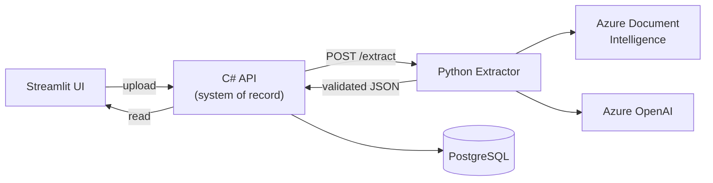

# Lab Report Extractor 

An AI-supported pipeline that extracts **structured data from unstructured medical lab
reports** (PDFs), validates it, and stores it in a structured target — built for a lab/clinic
back-office that today transcribes PDF lab results into a LIMS/EHR by hand.

All data is synthetic (no real PHI), but the system is designed as if it were real PHI —
see [`docs/design.md`](docs/design.md#compliance--security-posture).

## Key features

- **Hybrid OCR + LLM extraction** — Azure Document Intelligence reads structure (tables,
  reading order, word confidence), Azure OpenAI maps that onto a fixed schema. Handles
  document variance *by construction*, not per-template code.
- **Confidence-based review routing** — low-confidence results are never auto-accepted;
  they're routed to a human review queue instead.
- **Plausibility check** — recomputes each result's normal/abnormal flag from value vs.
  reference range; a mismatch with the printed flag forces review regardless of
  confidence, catching a class of error confidence scores alone would miss.
- **Batch processing** — a whole folder of documents in one run, with per-document error
  logging (corrupt/unreadable files are skipped, not fatal).
- **Full-stack, dockerized** — Python extraction engine, C# API + Postgres system of
  record, and a Streamlit review UI, wired together with `docker compose up`.
- **Evaluated, not just claimed** — per-field, per-layout accuracy against ground truth,
  plus a prompt-variant comparison that picked the production prompt. See
  [`docs/evaluation.md`](docs/evaluation.md).

## Tech stack

| Layer | Choice | Why |
|---|---|---|
| Extraction engine | Python (FastAPI) | Best-supported ecosystem for the Azure AI SDKs; stays stateless and swappable |
| OCR + layout | Azure Document Intelligence (`prebuilt-layout`) | Structural table/text extraction with per-word confidence — no fixed coordinates, so it survives layout drift |
| LLM structuring | Azure OpenAI via Azure AI Foundry | Structured outputs map free-form DI output onto a fixed schema; stays in-tenant (no public OpenAI) |
| Schema / validation | Pydantic v2 | Type-checked schema at every boundary; validation failures surface before a bad record reaches storage |
| Service layer | C# / ASP.NET Core minimal API + EF Core | The Microsoft-shop half of the stack; owned-entity mapping keeps the DB schema in sync with the domain model with no `.Include()` chains |
| Database | PostgreSQL | Relational shape (Patient → LabReport → Result/Diagnosis) is fixed and known up front — see the Cosmos DB tradeoff in `docs/design.md` |
| UI | Streamlit | Fast to stand up a reviewer-facing upload + review-queue screen without a separate frontend build |
| Containerization | Docker + docker-compose | One command (`docker compose up`) reproduces the whole stack for a reviewer with no local installs |
| CI/CD | GitHub Actions | Lint, test + coverage gate (70%), and a Docker build/smoke-test job, all free-tier, no secrets required |

## Flow

Document → Azure DI (OCR/layout) → Azure OpenAI (structure to schema) → transform/validate
(confidence routing + plausibility check) → persisted to Postgres by the C# API → reviewed
in Streamlit. Full architecture and data model: [`docs/design.md`](docs/design.md).

## Running it

1. Copy `.env.example` to `.env` and paste in your keys and secrets.
2. `docker compose up`
4. Open:
   - Streamlit UI: http://localhost:8501
   - C# API (Swagger): http://localhost:5005/swagger
   - Python extractor (docs): http://localhost:8000/docs

No local Python/.NET/Postgres install needed — everything runs in containers.

## Testing & coverage

Both CI jobs (`python-ci`, `dotnet-ci`) run their suite with coverage on every push and
gate at a **70% floor** — low enough not to block normal work, there to catch regressions.

- **Python (93%)**: the safety-critical logic (`validate.py`, `transform.py`) is at
  96-100%. See [`docs/design.md`](docs/design.md).
- **.NET (89%, generated code excluded)**: round-trips `LabReportRepository` through a real
  Postgres (`Testcontainers.PostgreSql`) to prove the owned-entity/JSONB mapping in
  `LabReportDbContext` works, plus `DbInitializer` and the `/documents` endpoints
  end-to-end.

## Docs

- [`docs/design.md`](docs/design.md) — use case, architecture, Azure production mapping, compliance
- [`docs/evaluation.md`](docs/evaluation.md) — accuracy results, prompt-variant comparison