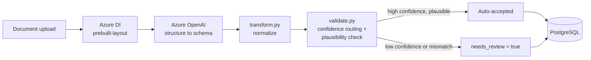
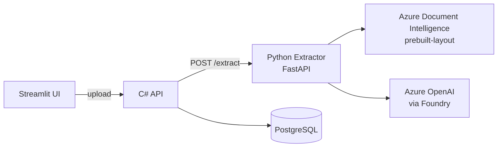

# Design

Who this is for, how it's built, how it maps to Azure in production, and how it handles
PHI. Read top to bottom for the full narrative, or jump to a section.

- [Use Case](#use-case)
- [Architecture](#architecture)
- [Azure Production Mapping](#azure-production-mapping)
- [Compliance & Security Posture](#compliance--security-posture)

---

## Use Case

### Persona

A lab/clinic back-office administrator who manually transcribes values from PDF lab
reports into a LIMS/EHR today — slow, repetitive, and error-prone at volume. They are not
a developer and not expected to judge model internals; they need extracted values plus a
clear signal for which ones to double-check.

### Input / output schema

**Input:** one lab report document (PDF), uploaded via `POST /documents`
(C# API) or `POST /extract` (Python extractor directly).

**Output:** one structured `LabReport` record ([`schema.py`](../src/extractor/schema.py)):

| Field | Notes |
|---|---|
| `patient` | `patient_id`, `name`, `dob`, `sex` |
| `report_date`, `collection_date`, `ordering_physician`, `lab_name` | report-level metadata, all optional — not every lab prints all of them |
| `results[]` | `analyte` (open string, not an enum), `value`, `unit`, `ref_range_raw`/`ref_low`/`ref_high`, `printed_flag`/`computed_flag`, `confidence`, `needs_review` |
| `diagnoses[]` | free-text `text` + `confidence` |
| `extraction_model`, `extracted_at`, `needs_review` | provenance + the routing decision, on every record |

`needs_review` is the field the persona actually acts on: `false` means auto-accepted,
`true` means a human should look at it before it reaches the LIMS/EHR.

### Business value

- **Time saved:** replaces manual line-by-line transcription with upload + review of only
  the flagged fields.
- **Error reduction:** the plausibility check (recompute flag from value vs. reference
  range) catches printed-flag/value mismatches a tired transcriber would copy verbatim —
  see the doc05 doubled-arrow OCR case in [Evaluation](evaluation.md).
- **Throughput:** one document per API call or a full folder via `batch.py`; corrupt/unreadable
  files are logged and skipped rather than stopping the run.
- **Auditability:** every record carries `extraction_model` + `extracted_at` provenance,
  which a manual transcription workflow has no equivalent of.

### Success metrics

- **Field-level accuracy:** ≥95% overall on non-flag fields (measured: 100%); `printed_flag`
  at 98% with the winning prompt (see [Evaluation](evaluation.md)) — the one miss is a
  documented OCR limitation, not a modeling error, and is still caught by the plausibility
  check downstream.
- **Review-routing precision:** no result under the confidence threshold is ever
  auto-accepted (enforced in `validate.py`, tested).
- **Zero silent failures:** every document in a batch either produces a record or a logged,
  skipped error — never a crash.
- **Time-per-document:** target is upload-to-structured-record in seconds, vs. minutes of
  manual transcription per report.

---

## Architecture

### Pipeline

### Service split

- **Python extraction engine** (`src/extractor/`, FastAPI) — stateless. Input: a document.
  Output: a validated, structured JSON record with per-field confidences. Calls Azure DI +
  Azure OpenAI. Also runnable as a batch CLI. **Never writes to Postgres.**
- **C# service layer** (`src/api/`, ASP.NET Core + EF Core) — the front door and **system
  of record**. Receives documents, calls the Python extractor over HTTP, persists to
  Postgres, exposes read APIs.
- **Streamlit UI** (`src/ui/`) — uploads a document to the C# API and shows extracted
  fields, confidences, validation flags, and the review queue.
- **PostgreSQL** — relational store, owned **exclusively** by the C# API (single writer).

Deliberate ownership rules: Python is stateless and never touches the DB; Postgres has
exactly one writer (the C# API); secrets come only from the environment, never hardcoded.

### Handling document variance

The brief requires coping with slightly different report formats — handled **by
construction, not by templates**: Azure DI reads text/tables structurally (no fixed
coordinates), and the LLM maps whatever DI returns onto the fixed Pydantic schema, so a
moved table, reordered section, or renamed label doesn't need new code.

### Data model

Patient 1—* LabReport 1—* Result, and LabReport 1—* Diagnosis:

| Entity | Fields |
|---|---|
| **Patient** | `patient_id`, `name`, `dob`, `sex` |
| **LabReport** | `report_date`, `collection_date`, `ordering_physician`, `lab_name`, `source_file`, `extraction_model`, `extracted_at`, `needs_review` |
| **Result[]** | `analyte`, `value`, `unit`, `ref_low`, `ref_high`, `printed_flag`, `computed_flag`, `confidence`, `needs_review` |
| **Diagnosis[]** | `text`, `confidence` |

In EF Core (`LabReportDbContext`): `LabReport` is the sole aggregate root; `Patient` is
flattened via `OwnsOne`; `Results` gets its own table via `OwnsMany` (the one-to-many that
drives the review queue); `Diagnoses` is a JSONB column via `OwnsMany().ToJson()`. Two
tables total: `lab_reports` + `results`. No migrations — schema is created from the model
via `EnsureCreatedAsync()` on startup.

Relational (Postgres) was chosen over a document store (Cosmos DB) because the shape is
known up front and fixed across the four entities — see the Cosmos DB note under
[Azure Production Mapping](#azure-production-mapping) for when that call would flip.

### Data quality & validation rules

Rules a record must satisfy to be trusted without a human looking at it. Owned by
`schema.py` (shape), `transform.py` (normalization), `validate.py` (routing +
plausibility), run in that order on every extraction.

**Mandatory fields** — enforced by Pydantic; missing any of these fails validation before
the record is transformed, validated, or persisted:

| Field | Model |
|---|---|
| `patient.patient_id`, `patient.name` | `Patient` |
| `analyte`, `value`, `confidence` | `Result` |
| `source_file`, `extraction_model`, `extracted_at` | `LabReport` |

Everything else (`dob`, `sex`, `ordering_physician`, `report_date`, `unit`,
`ref_range_raw`, `printed_flag`, ...) is optional — the source document may genuinely
omit it (e.g. `doc09` prints no ordering physician), and treating it as mandatory would
flag every clean document for review with no benefit.

**Value ranges & the plausibility check** — the core medical-safety rule (`validate.py`):
recompute the normal/abnormal flag from value vs. reference range and compare it to the
flag printed on the document. A mismatch forces `needs_review = true` regardless of
confidence.

- Ranges are parsed by a tolerant parser (`transform.parse_reference_range`) covering
  hyphen/en/em-dash, `to`-separated, split low/high, and one-sided `>`/`<`/`≥`/`≤`
  bounds — load-bearing, since the plausibility check can't recompute a flag without it.
- A value beyond the range by >20% (`_CRITICAL_HIGH_MARGIN`/`_CRITICAL_LOW_MARGIN`) is
  `HH`/`LL` rather than `H`/`L`, matching the doc's doubled-glyph convention.
- Unresolvable range (both bounds `None`) → check is skipped, not guessed.
- **Proven, not claimed:** `doc09_rows_adversarial` prints Glucose `145.0` against a
  `70-100` range but flags it `N`; the recomputed `H` disagrees and forces review. And
  `doc05`'s doubled arrow (`↑↑`), misread by Azure DI as `[11]`, still forces review since
  the recompute doesn't depend on what glyph DI saw (see [Evaluation](evaluation.md)).

**Unit consistency** — `transform.normalize_unit` checks a result's unit against a known
set per canonical analyte, normalizing notation (`mg/dl` → `mg/dL`) but never converting
between systems. An unrecognized unit forces `needs_review` rather than assuming a
conversion.

**Analyte identity** — `analyte` stays an open string, canonicalized via a
synonym→canonical map (`transform._ANALYTE_SYNONYMS`), never a closed enum — an
unrecognized name passes through unchanged rather than being rejected, so a new lab's
naming never breaks extraction.

**Confidence routing:**

| Tier | Threshold | Outcome |
|---|---|---|
| high | `>= 0.85` | Auto-accepted. |
| medium | `>= 0.60` | Accepted, flagged for review. |
| low | `< 0.60` | Routed to review — never auto-accepted. |

`LabReport.needs_review` is the OR of every result's `needs_review` (confidence tier +
plausibility mismatch + unit mismatch), so any consumer checks one flag per report.

---

## Azure Production Mapping

How each piece of the local Docker Compose stack maps onto Azure for a real deployment.
Azure DI and Azure OpenAI are already Azure services locally — everything else here is
"docker-compose on a laptop" → "managed Azure equivalent."

| Local (docker-compose) | Azure production equivalent | Why |
|---|---|---|
| `extractor` container (FastAPI) | **Azure Container Apps** (or AKS if the org already runs it) | Stateless, scales to zero between bursts, no VM patching |
| `api` container (ASP.NET Core) | **Azure Container Apps** | Same runtime model as extractor; keeps both services on one control plane |
| `ui` container (Streamlit) | **Azure Container Apps** (or App Service) | Low-traffic internal tool; cheapest compute tier is enough |
| `db` container (Postgres 16) | **Azure Database for PostgreSQL – Flexible Server** | Managed backups, patching, HA; keeps the single-writer-via-EF-Core contract intact |
| Azure DI (`di_client.py`) | **Azure Document Intelligence** — already Azure | No change needed; it's already the managed, production service |
| Azure OpenAI (`llm_client.py`) | **Azure OpenAI via Foundry** — already Azure | Same — data already stays in-tenant, already the prod target |
| `.env` file | **Azure Key Vault** + managed identity | Real secrets never sit in a file or CI variable; container apps pull them at startup via identity, not a copied key |
| `EXTRACTOR_URL` / internal DNS (`lab-network`) | **Container Apps internal ingress** (or Azure Container Apps Environment) | Same private-network-only reachability as the Compose bridge network |
| User-facing ports (`8501`, `5005`, `8000`) | **Azure Container Apps external ingress** on the `ui`/`api` only; extractor stays internal-only | Extractor is an internal service in this architecture — no reason to expose it publicly in prod |
| No logging backend (stdout only) | **Application Insights** | Structured logs + traces across all three services; PHI-aware logging rule (no raw values at info level) carries over unchanged |
| GitHub Actions CI | **GitHub Actions** (kept) | Already builds/tests/pushes images; add a deploy stage targeting Container Apps |
| Manual `docker compose build` | **Azure Container Registry** + CI-built images | CI pushes versioned images to ACR; Container Apps pulls from there instead of building on the host |

The AI layer needs no migration — it's already running on managed Azure services today.
What changes for production is entirely the surrounding infrastructure (compute, secrets,
networking, observability), not the extraction pipeline itself.

### What doesn't change

The three-service split (`extractor` / `api` / `ui`) and the single-writer-to-Postgres rule
are exactly why this maps cleanly — nothing in the architecture is Docker-Compose-specific.
The only local-only piece is the `.env` file, which is a placeholder for Key Vault by
design (see [Compliance & Security Posture](#compliance--security-posture)).

### Why Postgres over Cosmos DB

The data is relational (Patient 1—* LabReport 1—* Result, LabReport 1—* Diagnosis) with a
fixed shape known up front — a relational store is the right default. Postgres already has
an escape valve for new, semi-structured fields without a migration: `Diagnoses` is stored
as a JSONB column (`OwnsMany().ToJson()`), so a few extra per-lab fields extend cleanly.
**Cosmos DB** becomes the better call only if the *whole record shape* starts varying
per lab — not just a few extra fields, but no fixed schema at all worth keeping — at the
cost of losing cross-entity joins/transactions and the single-writer simplicity EF Core
gives today.

---

## Compliance & Security Posture

All data in this repo is **synthetic** — no real PHI. The system is designed as if it
were real PHI, since that design posture is the point being evaluated, not the data.

- **PHI / GDPR:** the schema captures only what's needed to route and audit a result — no
  "just in case" fields. Raw patient values are never logged at info level, only
  provenance (`extraction_model`, `extracted_at`, `confidence`) and `needs_review`.
  Postgres is the single system of record (one writer, the C# API), so GDPR
  access/erasure requests have exactly one place to act on — the stateless Python
  extractor holds no PHI.
- **Data residency:** Azure OpenAI (via Foundry), not public OpenAI — data stays
  in-tenant, never used for training. Production pins the DI resource, OpenAI
  deployment, and Postgres Flexible Server to one Azure region.
- **Secrets:** local reviewer keys live in a gitignored `.env`, emailed directly, scoped
  to throwaway free-tier resources and rotated/revoked after evaluation — disposable by
  design, not a production pattern. Production replaces `.env` with **Azure Key Vault** +
  managed identity per service (see [Azure Production Mapping](#azure-production-mapping)),
  with versioned secrets on a rotation policy (e.g. 90-day) that needs no redeploy.
- **Audit trail:** every `LabReport`/`Result` carries `extraction_model`, `extracted_at`,
  `confidence`, and `needs_review`, so the routing decision (the plausibility check under
  [Architecture](#architecture)) is reconstructable after the fact. Production adds
  Application Insights request-level audit (who reviewed a flagged record) on top.
- **Known limitation:** OCR isn't infallible even at high reported confidence — see the
  doc05 doubled-arrow case in [Evaluation](evaluation.md), where Azure DI misread a glyph
  at 97% confidence. The plausibility check exists specifically to catch this class of
  failure.